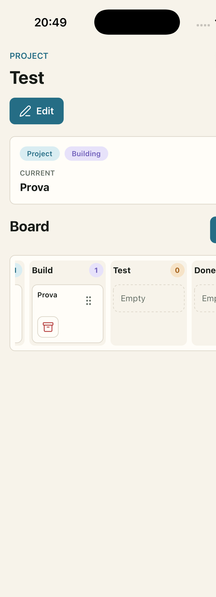

# Projects Manager

Projects Manager is an Expo app for Android and iOS phones and tablets. The MVP is a
personal task and project manager with three working areas: Todos, Projects, and
Roadmap.

The production direction is documented in `context/projects-manager`. The app
code is in `projects-manager`.

## Preview



## Stack

- Expo SDK 56 with Expo Router and TypeScript
- Convex for the no-auth demo/dev backend
- NativeWind plus app-owned UI primitives
- Biome, Lefthook, and GitHub Actions for checks
- pnpm for dependency management

## Quick Start

```bash
cd projects-manager
pnpm install
cp .env.example .env.local
pnpm dev
```

Set `EXPO_PUBLIC_CONVEX_URL` in `.env.local` after configuring Convex with
`pnpm dev:backend`.
